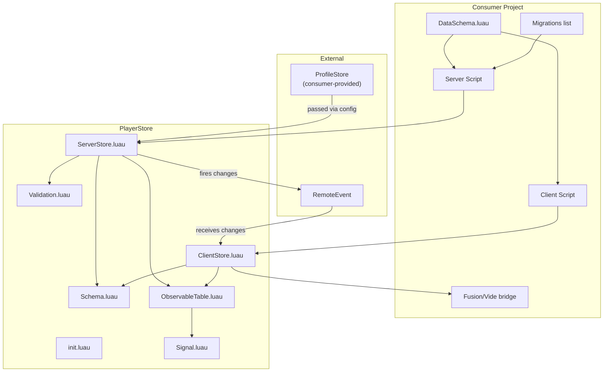
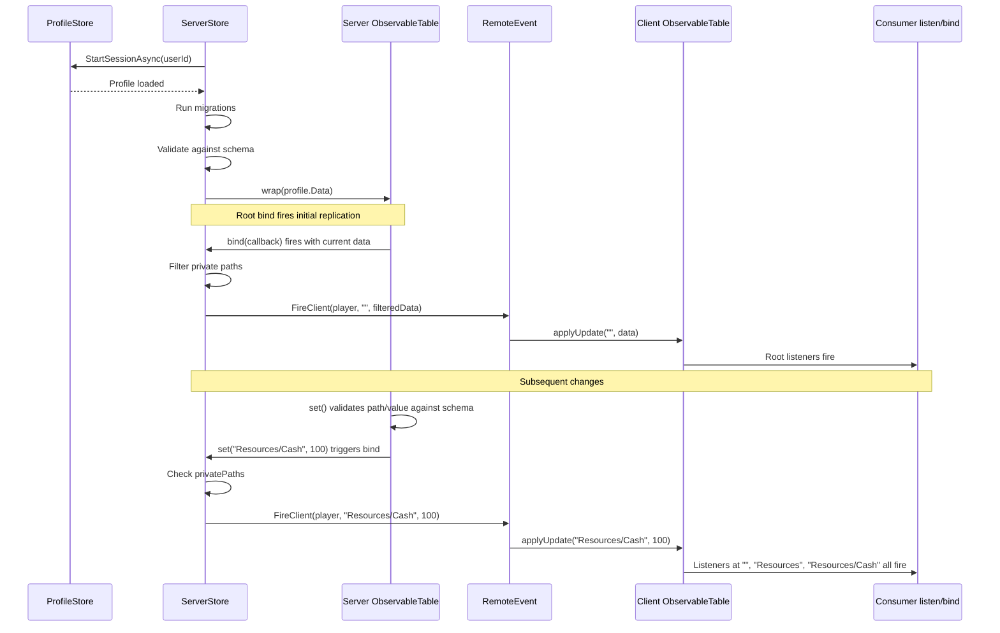

# Architecture

## System Overview



## Data Flow



## Module Descriptions

### Signal.luau

Minimal signal (~20 lines). `Connect` returns a disconnect function (no Connection object). Used internally by ObservableTable -- not exposed to consumers.

### Schema.luau

Processes consumer-defined schema definitions into three artifacts:

- **template** -- Plain Luau table with all markers resolved to their default values. Used by ProfileStore as the data template and by the validation system as the structural reference.
- **mapPaths** -- Set of paths marked with `map()`. These skip deep structural validation since their keys are dynamic and can't be checked against a fixed template.
- **privatePaths** -- Set of paths marked with `private()`. Excluded from client replication entirely.

#### Type-erasure trick

`map()` and `private()` return marker objects at runtime but cast the return as `:: never`. Since `never` is assignable to any type in Luau, this lets the type checker see the consumer's annotation (e.g. `{ [string]: number }`) while the runtime value is actually a marker table.

```
Consumer writes:  Inventory = map {} :: { [string]: number }
Type checker sees: Inventory: { [string]: number }
Runtime value:     { __playerstore = true, kind = "map", default = {}, replicate = true }
```

### ObservableTable.luau

Path-based change tracking wrapper around a plain Luau table. Core primitive used on both server and client.

#### Hierarchical notification

When `set("Resources/Cash", 100)` is called:

1. The value is written to the underlying table at `table.Resources.Cash`
2. Signals fire in order: `""` (root), `"Resources"`, `"Resources/Cash"`
3. Each signal receives four arguments: the value at that path, the path itself, the specific value that changed, and the specific path that changed

This allows a root listener to see all changes (used for replication), a mid-level listener to react to any change in a sub-tree, and a leaf listener to track a single value.

#### Optional path argument

`get()`, `listen()`, and `bind()` accept an optional path. When omitted, they operate on the root. The type signature uses intersection types to prevent `(function, function)` from matching:

```
listen: ((self, Callback) -> () -> ()) & ((self, string, Callback) -> () -> ())
```

#### Optional validator

`wrap(tbl, validator?)` accepts an optional `(path, value) -> (boolean, string?)` callback. When provided, `set()` calls it before writing and errors if the validator rejects. ServerStore passes in a validator backed by `Validation.validateWrite`, so all writes through `observe():set()` are automatically checked against the schema. ObservableTable itself has no schema dependency -- the validator is an opaque function.

#### applyUpdate()

Unlike `set()` which errors if the path doesn't exist, `applyUpdate()` creates intermediate tables as needed. Used by ClientStore to apply server-sent updates to an initially-empty table. Not subject to validation since it's only called internally by the replication system.

### Validation.luau

Structural validation extracted from ServerStore. Two functions:

- **`validateData(data, template, mapPaths)`** -- Recursively checks that all template keys exist in the data with matching types. Skips deep validation for map paths. Used on load after migrations.
- **`validateWrite(schema, path, value)`** -- Checks a single path/value pair against the schema. Resolves the path through the template, returns early for map paths (any key allowed), and type-checks leaf values. Used as the ObservableTable validator on the server side.

### ServerStore.luau

Manages the full player data lifecycle:

1. **Load** -- Starts a ProfileStore session, runs migrations, validates data structure, wraps in ObservableTable with a schema-backed validator
2. **Write validation** -- Every `set()` call on the ObservableTable is validated against the schema (path existence, type correctness, map path bypass)
3. **Replicate** -- Root bind on the ObservableTable filters private paths and sends changes to the client via a library-owned RemoteEvent
4. **Save hooks** -- Consumers register callbacks that run before each ProfileStore save
5. **Unload** -- Ends the session, destroys the ObservableTable, cleans up references

The RemoteEvent is created by the library (named `__PlayerStore_{storeId}`) and parented to ReplicatedStorage. Consumers don't manage networking.

#### Migration system

Migrations are an ordered list of functions provided by the consumer. The version is simply the list index. On load:

- New players (version = -1): reconcile from template, set version to list length
- Existing players: run all migrations from index `currentVersion + 1` to `#migrations`, then validate

Validation recursively checks that all template keys exist in the data with matching types, skipping paths in `mapPaths`.

### ClientStore.luau

Thin read-only wrapper around ObservableTable. On creation:

1. Builds a client-side template from the schema (excluding private paths)
2. Wraps it in an ObservableTable
3. Connects to the server's RemoteEvent
4. Applies incoming updates via `applyUpdate()`

Exposes `get()`, `listen()`, and `bind()` -- no `set()`. The consumer can only read and react to data; mutations happen server-side only.

## Design Decisions

### ObservableTable on both sides

Rather than auto-generating framework-specific reactive structures on the client (Fusion Values, Vide sources, etc.), both server and client use the same ObservableTable API. The consumer bridges to their UI framework with a trivial utility (~6 lines). This eliminates framework dependencies, adapter systems, and the type-mismatch problem that comes with transforming the schema type into a reactive type.

### No proxy

We considered using Luau metatables to intercept `data.Resources.Cash = 100` and automatically trigger observers. This would give typed writes without string paths. However, proxies break `table.clone()`, identity comparison (`==`), and any code using `rawget`/`rawset`. For a library meant to be invisible infrastructure, these footguns outweigh the ergonomic benefit. Instead, `getData()` returns the real table for typed reads, and `observe():set()` handles tracked writes.

### ProfileStore as a consumer-provided dependency

ProfileStore is passed in via the `createServerStore` config rather than required internally. This avoids fragile `require()` paths that vary across project layouts and package managers. Since we only use ProfileStore as an opaque API (`.New()`, `.StartSessionAsync()`, etc.) and need no types from it, passing it in is clean and gives the consumer full control over which version they use and where it lives.

### Raw values with minimal markers

Only two markers exist: `map()` and `private()`. Everything else uses raw Luau values. Wrapping every field in constructors (like `field(0)` instead of `0`) adds ceremony with no benefit for the 90% of fields that are plain values. The markers stand out visually, which is a feature -- they indicate genuinely special behavior at a glance.

### Automatic write validation

Every `set()` on the server-side ObservableTable validates the path and value against the schema. This catches typos, type errors, and invalid paths immediately at the call site rather than silently corrupting data that would only fail on the next load. The validation is injected via an opaque callback, keeping ObservableTable generic and decoupled from the schema system.

### Disconnect functions over Connection objects

Signal's `Connect` returns a plain `() -> ()` disconnect function rather than a `{ Disconnect: () -> () }` object. This is simpler, uses less memory, and composes well with cleanup patterns in UI frameworks (Fusion scopes, etc.).
